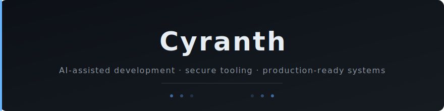

### AI-assisted development, secure developer tooling, and production-ready web systems.

I build tools that help AI coding agents work safely inside real repositories — context management, documentation workflows, automation, and leakage-risk detection. My focus is on practical, production-grade systems rather than demos.

**Stack:** .NET, ASP.NET Core, C#, MSSQL, GitHub Actions, Docker, Linux, Cloudflare

---

### Featured Project

**[agent-context-kit](https://github.com/Cynrath/agent-context-kit)**
Offline-first repository context and safety toolkit for AI-assisted development.

- Repository analysis
- Task-first workflow generation
- AI agent instruction files
- Secret / PII / local path / brand leakage risk detection
- CI-friendly reports

---

### Current Focus

- AI-assisted development workflows
- Secure coding-agent pipelines
- Practical open-source developer tools
- Production-ready web and admin systems

---

### Tech Stack

`.NET` `ASP.NET Core` `C#` `MSSQL` `GitHub Actions` `Docker` `Linux` `Cloudflare` `Git` `Markdown`

---

### Principles

| | |
|---|---|
| Docs first | Every change starts with documentation |
| Task first | Scope, acceptance criteria, rollback before code |
| Security-aware | Secrets, permissions, audit trails by default |
| Production-ready | No demo-ware — built to run in real environments |
| Maintainable | Readable, testable, boring technology |

---

### Contact

Open an issue or discussion on any public repository.
