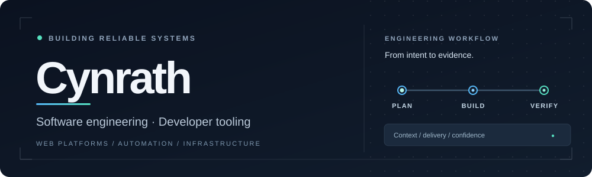

### AI-assisted development, developer tooling, and production-ready web systems.

I build practical software for real repositories: coding-agent workflows, developer automation, secure admin systems, and production-grade web platforms.

  
  
  

---

## Featured Project

| Project | Summary |
| --- | --- |
| [AgentContextKit](https://github.com/Cynrath/agent-context-kit) | Offline-first developer toolkit that helps make repositories safer and easier for AI coding agents to understand and work with. |

**AgentContextKit focuses on:**

- Repository and instruction analysis.
- Agent-ready context and workflow preparation.
- Task-first and docs-first development workflows.
- Security, secret, privacy, and repository-hygiene checks.
- CI-friendly reports and automation-ready outputs.

Project details, installation, commands, architecture, development status, and release information live in the [AgentContextKit repository](https://github.com/Cynrath/agent-context-kit).

---

## Current Focus

| Area | Direction |
| --- | --- |
| AI-assisted development | Safer context, agent workflows, and developer automation |
| Developer tooling | Practical tools for real repositories and repeatable engineering workflows |
| Production web systems | ASP.NET Core MVC, admin panels, RBAC, audit logs, SEO, deployment |
| Operations | GitHub Actions, Docker, Linux, Cloudflare, MSSQL, server workflows |

---

## Tech Stack

` TypeScript ` ` Node.js ` ` .NET ` ` ASP.NET Core ` ` C# ` ` MSSQL ` ` EF Core ` ` GitHub Actions ` ` Docker ` ` Linux ` ` Cloudflare ` ` Git `

---

## Principles

| Principle | Meaning |
| --- | --- |
| Docs first | Changes start with context, scope, and documentation. |
| Task first | Acceptance criteria and rollback notes before implementation. |
| Security-aware | Secrets, permissions, audit trails, and safe defaults matter. |
| Production-ready | Built for real environments, not throwaway demos. |
| Maintainable | Prefer readable, testable, predictable technology. |

---

## Contact

Open an issue or discussion on any public repository.
