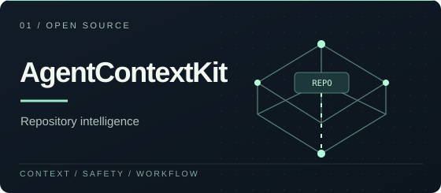
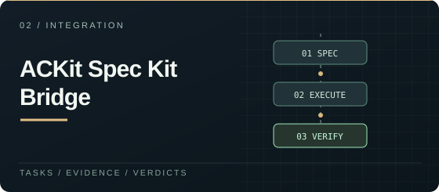

**Building dependable software, purposeful tools, and practical infrastructure.**

I build practical software for real repositories: coding-agent workflows, developer automation, secure admin systems, and production-grade web platforms.

<a href="#featured-projects">Featured Projects</a> · <a href="#current-focus">Current Focus</a> · <a href="#tech-stack">Tech Stack</a> · <a href="#principles">Principles</a>

## Featured Projects

<table>
<tr>
<td width="50%" valign="top">

</td>
<td width="50%" valign="top">

</td>
</tr>
<tr>
<td width="50%" valign="top">
<strong><a href="https://github.com/Cynrath/agent-context-kit">AgentContextKit</a></strong> 
An offline-first developer toolkit that helps make repositories safer and easier for AI coding agents to understand and work with.
</td>
<td width="50%" valign="top">
<strong><a href="https://github.com/Cynrath/ackit-spec-kit-bridge">ACKit Spec Kit Bridge</a></strong> 
Community bridge between GitHub Spec Kit and ACKit that maps spec-driven artifacts into deterministic task state, evidence, state-bound verification, completion gates, checkpoints and handoffs.
</td>
</tr>
<tr>
<td width="50%" valign="top">
      
</td>
<td width="50%" valign="top">
      
</td>
</tr>
<tr>
<td width="50%" valign="top">
<a href="https://github.com/Cynrath/agent-context-kit">Repository &rarr;</a> &nbsp;&middot;&nbsp; <a href="https://www.npmjs.com/package/@cynrath/agent-context-kit">npm &rarr;</a> &nbsp;&middot;&nbsp; <a href="https://github.com/Cynrath/agent-context-kit/blob/master/docs/guides/getting-started.md">Documentation &rarr;</a>
</td>
<td width="50%" valign="top">
<a href="https://github.com/Cynrath/ackit-spec-kit-bridge">Repository &rarr;</a> &nbsp;&middot;&nbsp; <a href="https://www.npmjs.com/package/@cynrath/ackit-spec-kit-bridge">npm &rarr;</a> &nbsp;&middot;&nbsp; <a href="https://cynrath.github.io/ackit-spec-kit-bridge/">Documentation &rarr;</a>
</td>
</tr>
</table>

**AgentContextKit focuses on:**

- Repository and instruction analysis.
- Agent-ready context and workflow preparation.
- Task-first and docs-first development workflows.
- Security, secret, privacy, and repository-hygiene checks.
- CI-friendly reports and automation-ready outputs.

Project details, installation, commands, architecture, development status, and release information live in the [AgentContextKit repository](https://github.com/Cynrath/agent-context-kit).

## Current Focus

| Area | Direction |
| --- | --- |
| Engineering workflows | Safer context, agent workflows, and developer automation |
| Developer tooling | Practical tools for real repositories and repeatable engineering workflows |
| Production web systems | ASP.NET Core MVC, admin panels, RBAC, audit logs, SEO, deployment |
| Operations | GitHub Actions, Docker, Linux, Cloudflare, MSSQL, server workflows |

## Tech Stack

` TypeScript ` ` Node.js ` ` .NET ` ` ASP.NET Core ` ` C# ` ` MSSQL ` ` EF Core ` ` GitHub Actions ` ` Docker ` ` Linux ` ` Cloudflare ` ` Git `

## Principles

**Understand the system → Define the change → Implement deliberately → Verify the result.**

| Principle | Meaning |
| --- | --- |
| Docs first | Changes start with context, scope, and documentation. |
| Task first | Acceptance criteria and rollback notes before implementation. |
| Security-aware | Secrets, permissions, audit trails, and safe defaults matter. |
| Production-ready | Built for real environments, not throwaway demos. |
| Maintainable | Prefer readable, testable, predictable technology. |

## Contact

Open an issue or discussion on any public repository.
